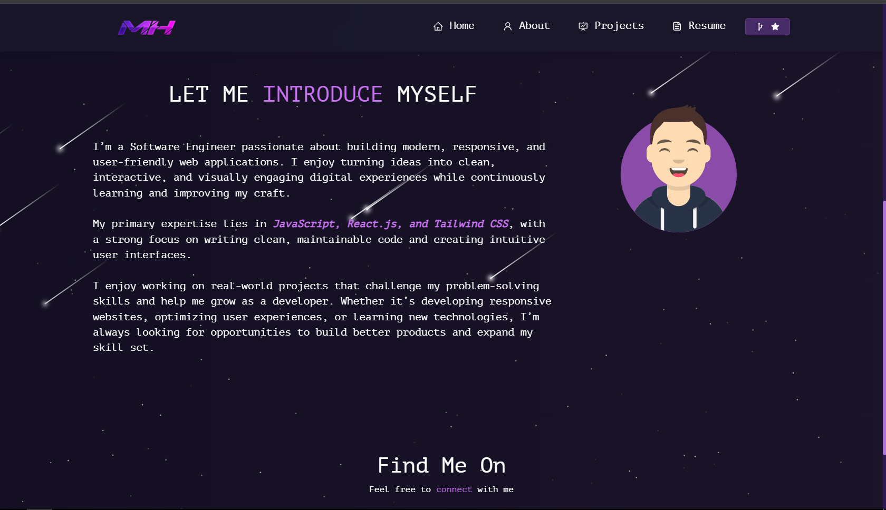

<div align="center">
  <h1>Muhammad Hashir — Portfolio</h1>
  <p>A personal portfolio website built with <strong>React.js</strong> showcasing projects, skills, and resume.</p>
  <p>
    <a href="https://github.com/Hashir-FrontEnd-dev/Portfolio" target="_blank">View on GitHub</a>
  </p>
</div>

<br/>

<div align="center">
  
</div>

<br/>

<p align="center">
  
  
  
  
</p>

---

## About

Personal portfolio website of **Muhammad Hashir** — a Software Engineer / Front-End Developer from Karachi, Pakistan. Features projects, technical skills, resume, and professional background.

---

## Tech Stack

| Category | Technologies |
|---|---|
| **Core** | React 17, Create React App, React DOM 17 |
| **Routing** | React Router v6 |
| **UI & Styling** | React-Bootstrap, Bootstrap 5, CSS3 |
| **Icons** | react-icons |
| **Animations** | react-tsparticles, typewriter-effect, react-parallax-tilt |
| **GitHub Widget** | react-github-calendar |
| **PDF** | react-pdf, @react-pdf/renderer |
| **HTTP Client** | Axios |
| **Video** | video-react |
| **Testing** | @testing-library/react, @testing-library/jest-dom, @testing-library/user-event |
| **Build & Deploy** | react-scripts 5, Vercel |

---

## Features

- **Particle animations** & meteor shower effect
- **Typewriter** rotating titles (Software Developer / Freelancer / Front End Developer)
- **Background music** toggle in the navbar
- **About page** — skills grid, tools, GitHub contribution calendar
- **Projects page** — showcase with live demos & GitHub links
- **Resume page** — inline PDF viewer with download button
- **Fully responsive**, dark-themed design
- **Social links** — GitHub, LinkedIn, Email

---

## Run

```bash
npm start
```

Open [http://localhost:3000](http://localhost:3000) to view it in the browser.

---

## Projects Showcased

| Project | Tech Stack | Live Demo |
|---|---|---|
| **E-commerce** | HTML5, CSS3, JavaScript | [Live](https://hashir-e-commerce-web.netlify.app/) |
| **Business-Nexus** | React, Next.js | [Live](https://nexus-three-sandy.vercel.app/login) |

---

## Author

**Muhammad Hashir**  
Front-End Developer | Software Engineer | Freelancer

- GitHub: [@Hashir-FrontEnd-dev](https://github.com/Hashir-FrontEnd-dev)
- LinkedIn: [Muhammad Hashir Siddiqui](https://www.linkedin.com/in/muhammad-hashir-siddiqui-646317418)
- Email: hashirmuhammad2245@gmail.com
